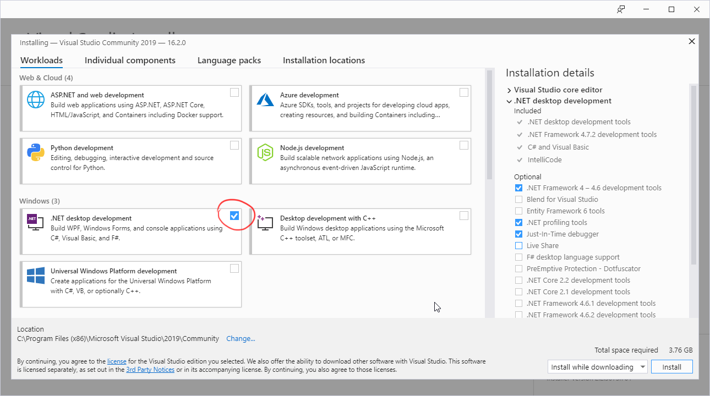
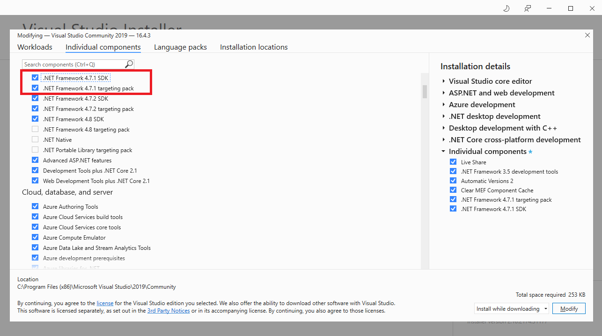

## Visual Studio installation

Visual Studio is *huuuuuuuge*, but don't fret - you need only a few things.

In the **Workloads** tab, select *.NET desktop environment*

In the **Individual components** tab, select *.NET Framework 4.7.1 SDK* and *.NET Framework 4.7.1 targeting pack*

After it installs, you're good to go.  
  
*Note:* if you are a student with a *.edu* email, you may be eligible for a free student license of [Reshaper](https://www.jetbrains.com/resharper/). It's a Visual Studio extension that makes life a bit nicer. Without a student license it's rather expensive, so don't feel pressured to get it.
