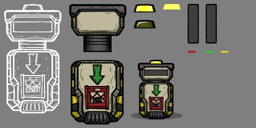
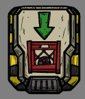
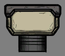
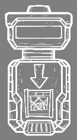
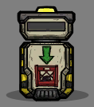

## Kanim Format

This section breaks down each of the files that make up a kanim using the **Conveyor Loader** as an example.

The file prefix for the Conveyor Loader is `conveyorin`.

### The Texture Atlas

Here is the `conveyorin_0.png` texture from the game assets.  
All of the graphics needed for the Conveyor Loader are stored in this texture.

### The Build File

To make sense of this texture, the game also needs to load a **build.bytes** file that matches the texture.  
The build.bytes file contains an array of **Symbols** that organize all of the sprites into named groups.

Here are some of the symbols in the `conveyorin_build.bytes` file:

* body
* meter_frame
* opening
* place
* ui

Every **Symbol** has at least one sprite under it. Which is why all of the sprites will have a number suffix like `_0`.  
These fully named sprites with a **numeric index** are called **Frames** (like a picture frame).

Here are the sprites that you get by cutting up the texture into the **Frames** defined in the `conveyorin_build.bytes` file:
| body_0 | opening_0 | place_0 | ui_0 |
|--------|-----------|---------|------|
|||||

Some of the **Symbols** in a build file will have multiple **Frames** like this:
| opening_0 | opening_1 | opening_2 |
|-------------|-------------|-------------|
| Symbol: `opening` | Symbol: `opening` | Symbol: `opening` |
| Index: 0 | Index: 1 | Index: 2 |
||||

Generally a **Symbol** that has multiple **Frames** is used to group all of the sprites that will be swapped during an animation. So in the case of the Conveyor Loader, you can see the yellow light has an On (Index 1) and Off (Index 2) sprite under the symbol named `opening`. This will be important to remember for later when we look at how the animation data makes the sprite blink.

Each **Symbol** also has 4 flags that can be toggled to change how they behave in the game:

* **Bloom**  
  Toggles whether the bloom shader is used to render the sprite. This makes it glow.
* **OnLight**  
  Toggles whether the symbol is used as a "on light" which is only shown when a building is on.
* **SnapTo**  
  Toggles whether the symbol is marked as a snapping point for other animations to snap to.
* **Foreground**  
  Toggles whether the symbol appears in a foreground layer so that it overlaps most other objects.

### The Anim File

The final piece of the kanim puzzle is the file that tells the game where (and when) all of the sprites go.  
The **anim.bytes** file contains an array of named animations called **Banks**.

Here are all of the **Banks** in the **anim.bytes** file:

* on
* off
* working_pre
* working_loop
* working_pst
* meter
* place
* ui

Every **Bank** has its own list of all of the **Key Frames** that make up an animation.  
Each frame is shown for 33ms and the game does not tween the postions of sprites between these frames.

A **Key Frame** contains yet another array made up of **Elements** that describe which sprites are present in the frame and how they are positioned.

### Important Tips / Details

* **A duplicate build.bytes or anim.bytes file does not conflict with the existing game kanims.**  
  You can take advantage of this fact to easily recolour sprites from the game.  
  Just copy the kanim files to your own mod folder and edit the texture file directly.
* **When you are editing original textures you must not draw past the imaginary "picture frame" around a sprite.**  
* **Do not resize or move the contents of a texture when directly editing it.**
* **Lots of kanims in the game assets do not have anim.bytes files**.  
  This is because the texture and build.bytes file are the only assets Klei needed to draw the graphics.  
  (For something that is not animated)
* **The game expects a complete set of files when loading kanims from mods.**  
  Even if you do not need any animations, you still need an **anim.bytes** file in your mod's kanim folder. This is especially important when you are making edits to those animations from the game that do not have anim.bytes files.
