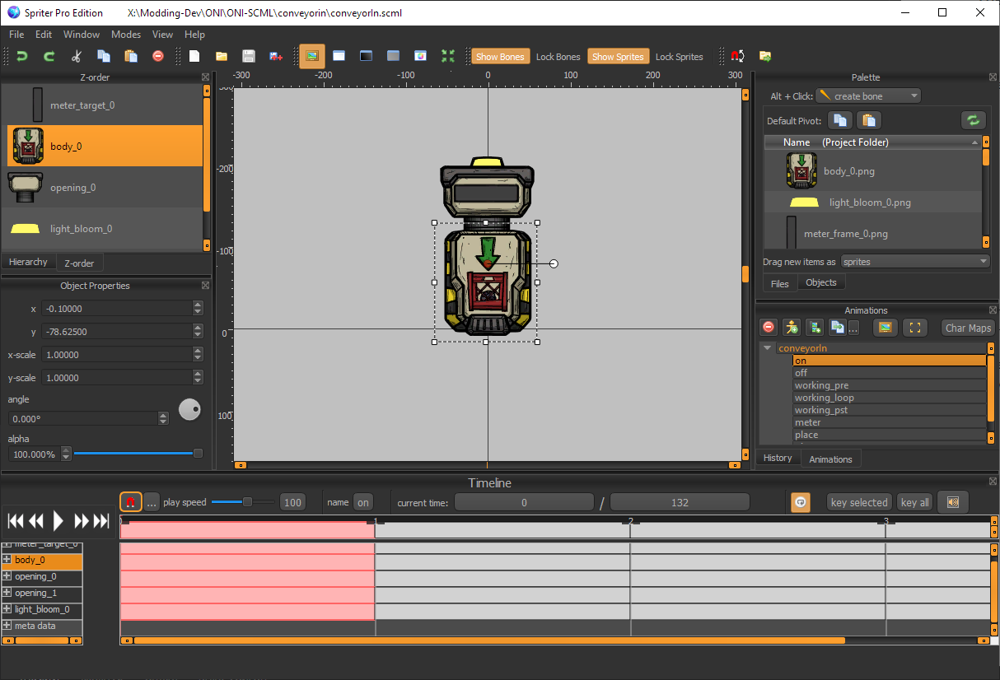
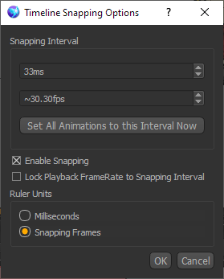

## Kanim Concepts in Spriter

**This section is not a tutorial on how to use Spriter.**  
If you do not already understand the Spriter UI and concepts then take the chance now to play with the software or watch some tutorials on YouTube.

This section **will** explain all of the parallels between a spriter project and a kanim. 

Continuing with the **Conveyor Loader** example above, this screenshot shows what the `conveyorin` kanim should look like once you have converted and loaded it in Spriter.

### IMPORTANT: Do not use bones or non-linear tweens to make your animations.
Spriter supports many features that are discarded when converting scml to kanim.

Bones will be thrown out, and positions of sprites will not look correct.

Kanim only uses keyframes, and the position of every sprite is defined each frame. If you leave gaps on the timeline, kanimal-se will be able to **linearly** interpolate between those keyframes. It will not preserve any sort of custom "curves" in the Spriter tweening options.

If you *still* need to use custom tweens, you will have to essentially destroy the tween once you are happy with the way it looks in Spriter. This can be done by inserting keyframes in all of the time steps between the two original keyframes. The tween will be "chopped up" into keyframes and can no longer be modified.

### Symbols & Frames

In Spriter, the parallel to the kanim **Symbols** is the window in the top right.  
The list of files here will become the symbol names that are added to the **build.bytes** file.  
Keep in mind that the `_0` in image filenames is necessary. It is used to create a **Frame** for that specific image. So `body_0.png` means that a symbol called `body` will be added to the build file and the specific image called `body_0.png` will be stored as index 0 under `body`. If a `body_1.png` existed it would be added under `body` as index 1.

You can also edit the **Pivot** point for each of the sprites, which will be stored in the build file with the corresponding **Frame**.

### Animation Names

The animation banks in the **anim.bytes** file are determined by the list of animations in the **Animations** window on the bottom right.  
The project must be set up to have one **Entity** with all of the animations as children of that entity. The name of the entity does not need to match anything. (TBC)  

The name of each animation directly matches the strings that Oxygen Not Included will use to play an animation.  
ex: `anim.Play("working_loop")`

### Animations

Every animation should be configured to the following timeline settings:

* Frames are 33ms long.
* **Enable Snapped** is checked.  
  Non-snapped frames are meaningless, they'll be snapped to the beginning of the timestamp by kanimal-se.
* Ruler Units set to **Snapping Frames**  
  This just makes it easier to work with the timeline.

From here the rest of the work to make the actual animation is Spriter as usual.  
The positions of the sprites and data you put in the **Object Properties** window will become the **Elements** in the **anim.bytes** file.  
**Reminder: Do not use bones or non-linear tweens!**