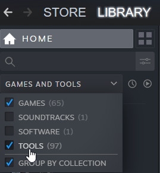

## Publishing to Steam using the Mod Uploader

### Downloading the uploader
You will find the uploader in your Steam library under the name of `Oxygen Not Included Uploader`. Make sure to enable showing tools in the library first:  

### Uploading the mod
The uploader tool lets you add and modify your existing mods. You need to prepare: 
* Mod files (follow instructions from the chapter above: the folder containing the `.dll`, not zipped. Only the mod files! No files belonging to the game!)
* Official mod name (how you name the mod on Steam is how the players will see it in-game)
* Mod description ([using Steam formatting](https://steamcommunity.com/comment/Announcement/formattinghelp))
* A thumbnail image
  
After filling all the fields, choose applicable tags (especially the compatibility tags: **Base Game** and/or **Spaced Out!**) and hit `Publish!`. Keep in mind, the tool is not perfect and sometimes throws a moody fit - keep a backup of your lenghty description in notepad to avoid excessive frustration.

### Making the mod public
If it is your first contribution to the Steam Workshop, your submission will be set to `private` and Steam will prompt you to accept terms of conditions. Once you do that, go to your mod page and then set the visibility to public.

That's it! When you need to edit the mod, you can tell the uploader to update only specific fields using the checkboxes next to them. 

### Versioning on Steam
Steam tends to have major issues with mod updates -- sometimes it will continue serving an outdated version for some people, and while there are some tricks to go around that (resubscribing, deleting the mod folder, wiping cache), there is no 100% viable way. Therefore, it's a good idea to not update too frequently and wait for more significant releases; or to also provide a link to downloadable mod files that can be installed outside of Steam.
